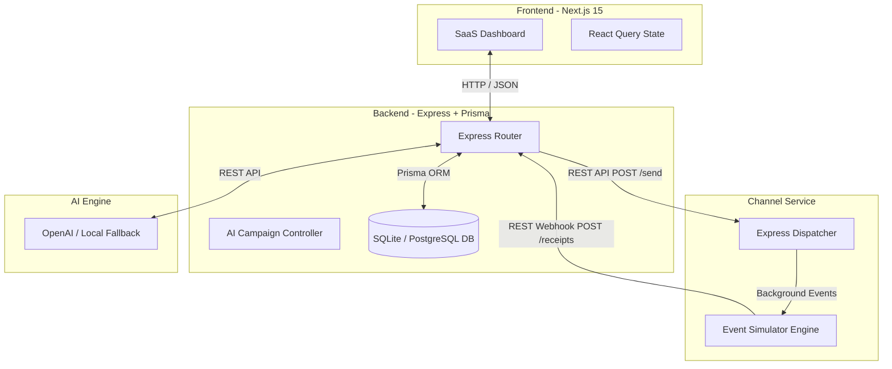

# XenoPilot 🚀

> **AI Marketing Agent for Consumer Brands** — A production-quality, AI-first CRM submission for the Xeno Engineering Internship Assignment 2026.

Instead of a traditional CRM, XenoPilot acts as an autonomous marketing agent. A marketer describes a high-level business goal (e.g., *"Bring back customers who have not purchased in 90 days"*), and XenoPilot automatically segments the audience, selects the optimal channel, drafts copywriting, simulates dispatch tracking, and updates dashboard metrics in real-time.

---

## 🏗️ Architecture Design



### Decoupled Microservices
1. **Frontend (Next.js 15 App Router)**: Styled with Tailwind CSS, using Recharts for analytics, and React Query for queries and cache invalidation.
2. **Backend (Express + TypeScript + Prisma)**: Manages CRM customer data, order registers, campaignProposal generation, and receipt attribution logic.
3. **Channel Service (Express + TypeScript)**: Simulates message transmission, delivery success rates, and customer open/click/conversion pipelines.

---

## ⚡ Scalability & Production Readiness Decisions

To prepare this system for enterprise-grade consumer volumes (millions of daily dispatches):

### 1. Message Queuing & Event-Driven Architecture
Direct HTTP calls from the CRM backend to the channel service are fine for simulation, but fail at scale.
* **Production Plan**: We replace the HTTP `/send` call with a message broker like **BullMQ (Redis)** or **Apache Kafka**.
* **Benefit**: Spikes in campaign launching won't saturate backend resources. Workers scale horizontally to read from the queue and throttle dispatch rates according to channel API limits.

### 2. Idempotence & Double-Spend Protection
Attributing conversions automatically generates customer orders. If webhook dispatches are retried due to network drops, we risk double-crediting orders.
* **Production Plan**: We enforce unique `eventUuid` keys on webhook receipt headers. The backend logs incoming webhook IDs and uses database transaction locks to verify if a conversion ID has already been credited.

### 3. Webhook Retry Handling
If the CRM backend is temporarily down when the channel service tries to post receipt updates:
* **Production Plan**: We implement exponential backoff retry algorithms in the channel webhook emitter (e.g. using a retry queue).

---

## 🚀 Getting Started (Local Setup)

### System Requirements
* **Node.js**: `v20.x` or higher (v22 recommended)
* **npm**: `v10.x` or higher

### Environment Variables (`.env`)
Create a `.env` file inside the `backend/` directory:
```env
DATABASE_URL="file:./dev.db"
PORT=5000
CHANNEL_SERVICE_URL="http://localhost:5001"
OPENAI_API_KEY="" # Add your key to enable real OpenAI GPT generation!
```

---

## 🏃 Run Commands

We provide a convenient powershell script to run all services concurrently:

```powershell
# In the root XenoPilot directory:
.\scripts\start-all.ps1
```

Or you can start the services manually in separate terminals:

### 1. Start Channel Service
```bash
cd channel-service
npm install
npm run dev
# Running on http://localhost:5001
```

### 2. Initialize and Start Backend
```bash
cd backend
npm install
npx prisma db push
npm run db:seed
npm run dev
# Running on http://localhost:5000
```

### 3. Start Frontend
```bash
cd frontend
npm install
npm run dev
# Running on http://localhost:3000
```

---

## 🛠️ Tech Stack & Tradeoffs

| Component | Technology | Tradeoff / Decision |
| :--- | :--- | :--- |
| **Database** | Prisma + SQLite (Local Dev) | SQLite requires zero installation, ensuring the app runs immediately. Easily switches to **Neon PostgreSQL** for production by updating `provider = "postgresql"` in `schema.prisma`. |
| **AI Layer** | OpenAI API + Hybrid Fallback | Integrates OpenAI for copy/segmentation, but provides a high-fidelity local heuristics fallback if no API key is specified, preventing setup blockers. |
| **Routing** | SPA View Switcher | Instead of separate App Router paths, the Next.js client switches views via state. This preserves state (e.g. tracking dispatch counts) seamlessly between view switches without route refresh lags. |

---

## 🔮 Future Improvements
1. **Interactive Node Canvas**: Visual drag-and-drop campaign journeys.
2. **True Segment Parser**: Integrating text-to-SQL compilers to automatically translate goals into complex SQL WHERE clauses.
3. **Template Designer**: WYSIWYG editor for email templates and WhatsApp message components.
